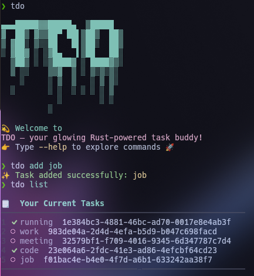

# 🦀 tdo  
> ⚡ A fast and minimal terminal to-do manager built in Rust.

---

## 📘 Overview  
`tdo` is a lightweight, no-nonsense task manager designed for developers who live in the terminal.  
It helps you **add**, **track**, and **complete** tasks — all without leaving your command line.  
Built in **Rust** for speed, safety, and reliability.  

---

## ✨ Features  
- 📝 Add, view, and delete tasks  
- ✅ Mark tasks as done or pending  
- 💾 Persistent storage (saves to a local file)  
- ⏰ Add deadlines for tasks  
- 🔁 Create recurring tasks (daily, weekly, etc.)  
- ⚙️ Simple and intuitive CLI commands  

---
### 🧩 Demo



---

## 🚀 Installation  

### 🦀 Prerequisite  
Ensure you have [Rust](https://www.rust-lang.org/tools/install) installed.  

### 🔧 Build from source  
```bash
git clone https://github.com/<your-username>/tdo.git
cd tdo
cargo build --release
````

The compiled binary will be available in:

```
target/release/tdo
```

Optionally move it to your system path:

```bash
sudo mv target/release/tdo /usr/local/bin/
```

---

## 🧠 Usage

### Add a task

```bash
tdo add "Finish the project report"
```

### View all tasks

```bash
tdo list
```

### Mark a task as done

```bash
tdo done 2
```

### Delete a task

```bash
tdo delete 3
```

### Add a task with a deadline

```bash
tdo add "Submit assignment" --due 2025-11-10
```

### Create a recurring task

```bash
tdo add "Team meeting" --repeat weekly
```

---

## 📂 File Storage

All tasks are stored locally in a file (e.g. `~/.tdo/tasks.json`) so that your list persists even after closing the terminal.

---

## 🧪 Example Output

```bash
$ tdo list
1. [x] Setup project structure
2. [x] Implement file storage
3. [x] Add recurring task feature (due: 2025-11-10)
```

---

## 🧩 Tech Stack

* **Language:** Rust 🦀
* **Concepts Used:** File I/O, Error Handling, Iterators, Testing
* **Storage:** JSON / Local file persistence

---

## 🤝 Contributing

Contributions are welcome!
Feel free to fork the repo, create a branch, and submit a pull request.

```bash
git checkout -b feature/new-feature
git commit -m "Added new feature"
git push origin feature/new-feature
```

---

## 🪪 License

This project is licensed under the **MIT License** — see the [LICENSE](LICENSE) file for details.

---

## 💬 Acknowledgements

Inspired by [Taskwarrior](https://taskwarrior.org), but designed to be **simpler**, **faster**, and **Rust-powered**.